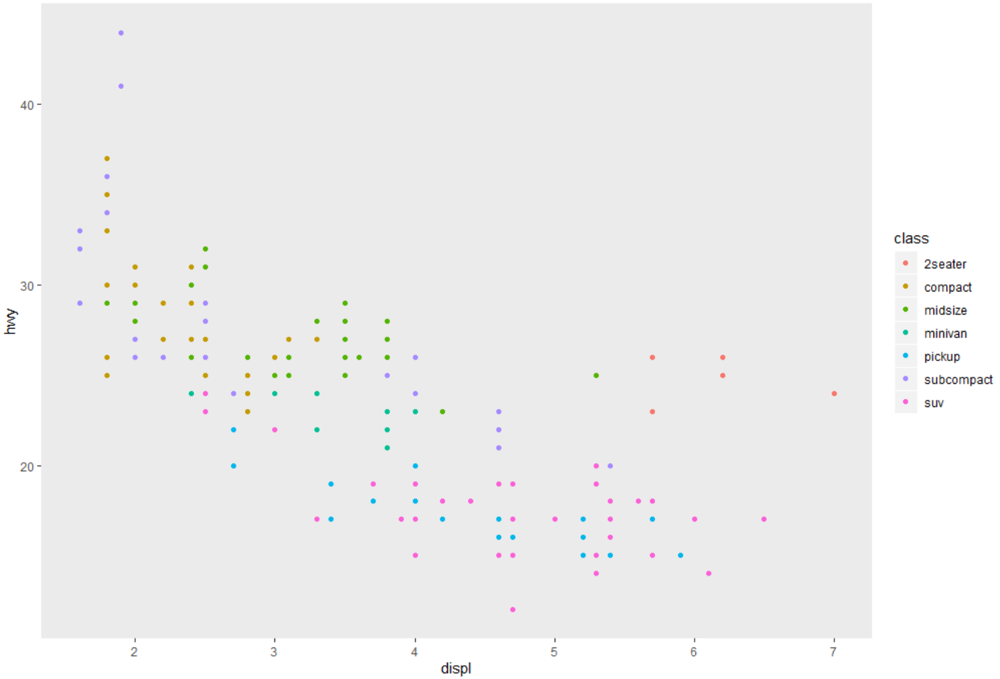

# Useful-R-Stuff

## Graphs

### Different size facets 

`ggforce::facet_row()`  
  
source: [@tjmaher](https://twitter.com/tjmahr/status/1229478565873356800)

### Drop grid lines
```r
ggplot(mpg, aes(displ, hwy, colour = class)) + 
    geom_point() + 
    theme(panel.grid = element_blank())
```

## Tables
